<div align="center">

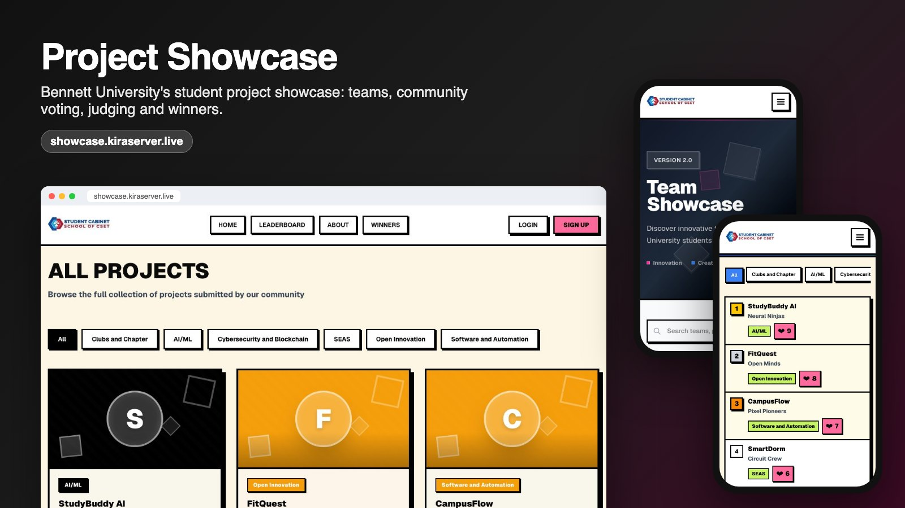

# Project Showcase

**A full-stack platform for a university project showcase: teams submit projects, students vote, judges score, and admins announce winners.**

[](https://showcase.kiraserver.live)


</div>

Built for the Student Cabinet of the School of CSET, Bennett University, where it ran a showcase of 139 student teams. Sign-up is limited to university email addresses.

## Try it

Open **[showcase.kiraserver.live](https://showcase.kiraserver.live)**: browsing, the leaderboard and winners are public. To vote or submit, use a demo account (tap it on the login page):

| Role | Where | Email | Password |
|---|---|---|---|
| Student (voter) | [Login](https://showcase.kiraserver.live/login) | `demo.student@bennett.edu.in` | `Demo@1234` |
| Team leader | [Login](https://showcase.kiraserver.live/login) | `demo.leader@bennett.edu.in` | `Demo@1234` |
| Judge | [Judge login](https://showcase.kiraserver.live/guest-login) | `demo.judge@bennett.edu.in` | `Judge@1234` |

The admin panel (`/admin`) is not part of the public demo.

## Features

**For students**
- Browse projects with search and category filters; open any project for details, tags and links
- Vote for up to **two projects per category** (enforced server-side in a locked transaction)
- Live leaderboard, overall or per category, and a winners page

**For teams**
- Sign up as a team leader and get a unique team code to share with teammates
- Submit a project with a cover image, tags, GitHub and demo links
- Manage team members and edit or delete the team's own projects

**For judges**
- Separate judge login and panel listing every project by category
- Score six criteria from 0 to 10 (innovation, pitching, presentation, creativity, functionality, scalability)
- Scores are tied to the signed-in judge on the server, and each judge sees only their own

**For admins** (`/admin`, behind its own login)
- Dashboard stats; manage teams, users and projects
- Results ranked by average judge score per category, with a tracker for projects still unjudged
- Announce 1st / 2nd / 3rd place per category
- Vote moderation (Likes control), with an **audit log** of every admin change shown in the panel

## Screenshots

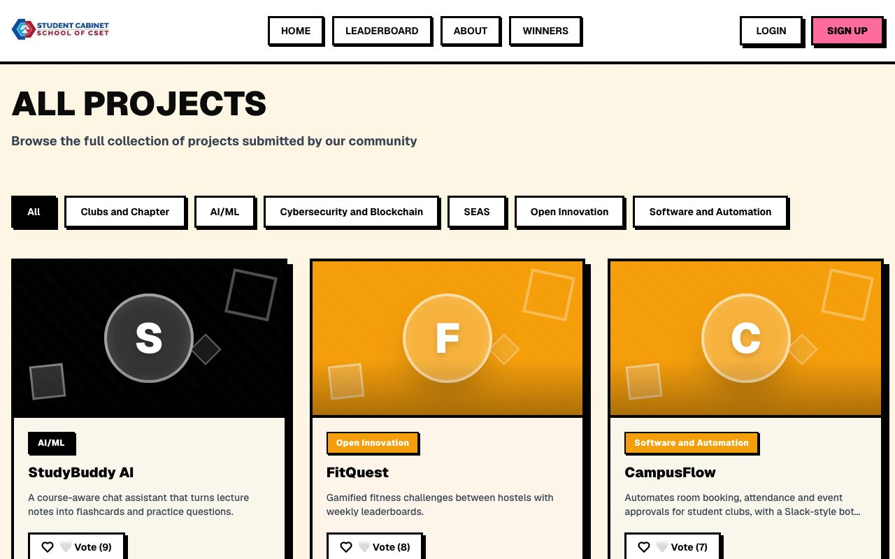

<table>
  <tr>
    <td width="50%">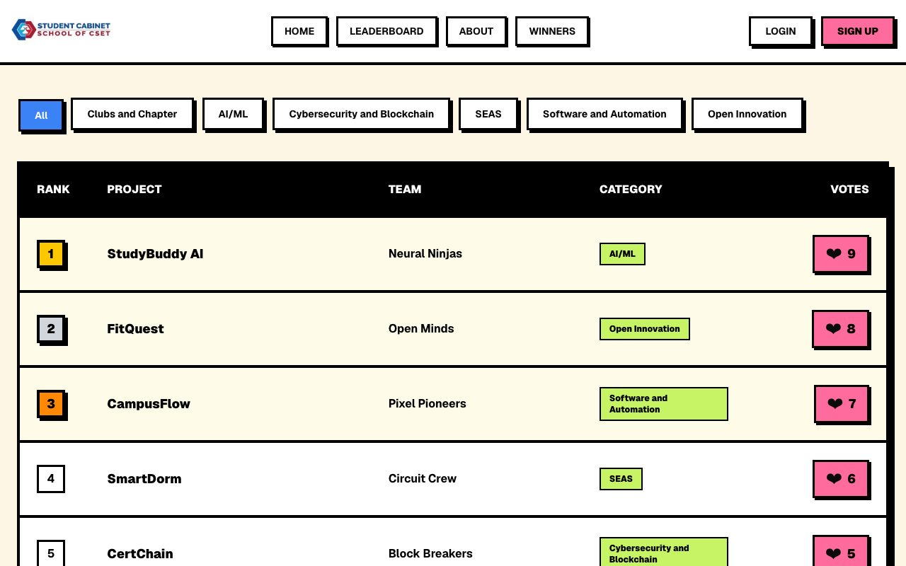</td>
    <td width="50%">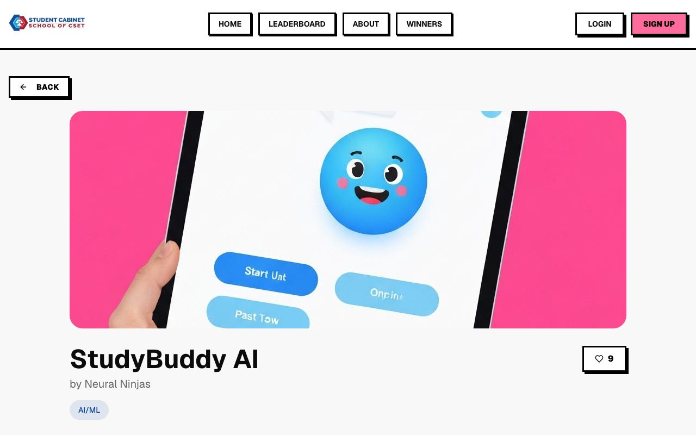</td>
  </tr>
  <tr align="center"><td>Leaderboard</td><td>Project details</td></tr>
  <tr>
    <td width="50%">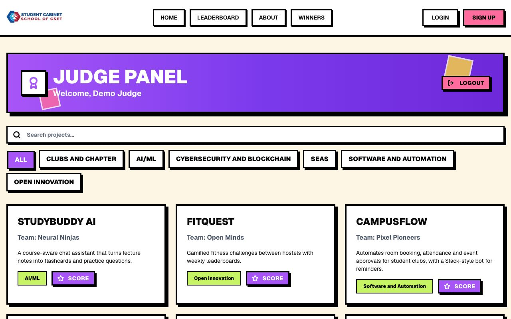</td>
    <td width="50%">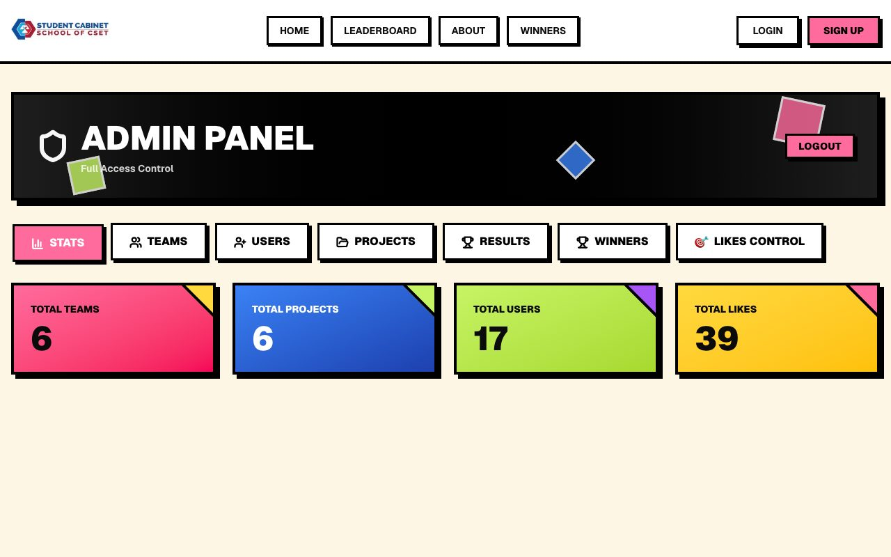</td>
  </tr>
  <tr align="center"><td>Judge panel</td><td>Admin panel</td></tr>
</table>

<table>
  <tr>
    <td>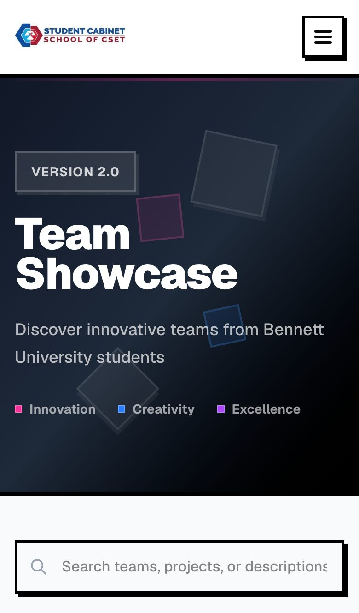</td>
    <td>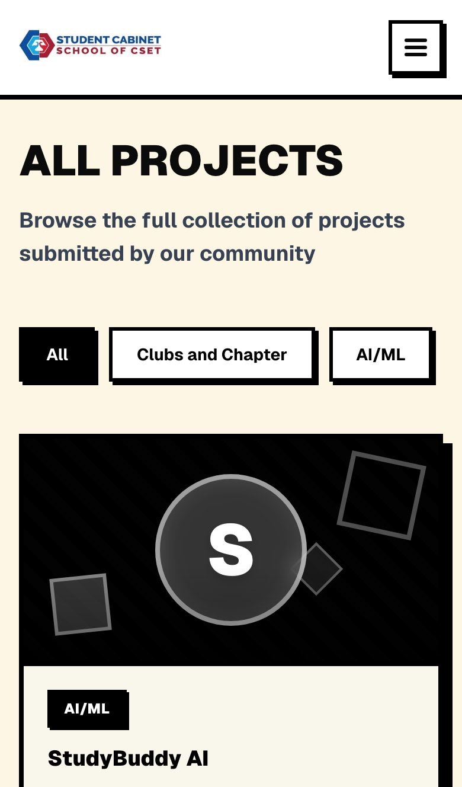</td>
    <td>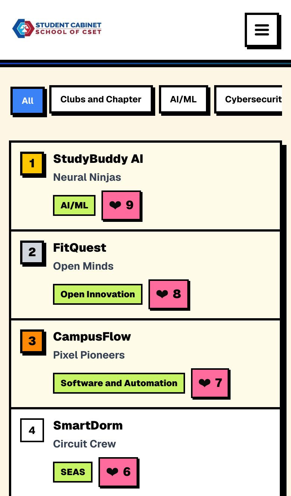</td>
    <td>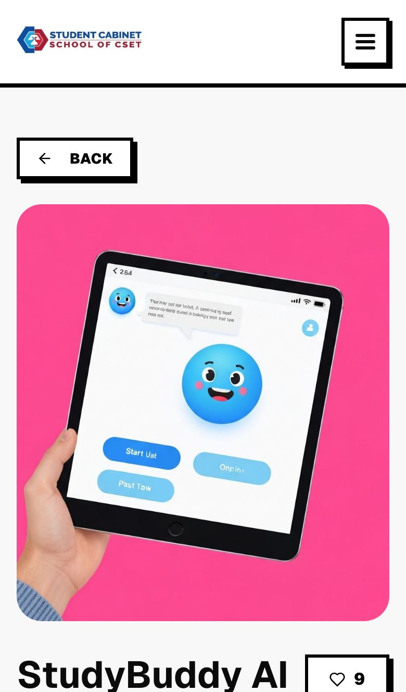</td>
  </tr>
</table>

## Tech stack

| Layer | Technology |
|---|---|
| Framework | Next.js 16 (App Router, `proxy.ts` route guards, standalone output), React 19, TypeScript |
| UI | Tailwind CSS 4, Radix UI primitives, neo-brutalist design system |
| Data | PostgreSQL 16 with plain parameterized SQL ([`postgres`](https://github.com/porsager/postgres)); schema in [`db/schema.sql`](db/schema.sql) |
| Auth | Separate JWT session cookies for students, judges and admin (`httpOnly`, `Secure`, `SameSite=Lax`, signed with jose); bcrypt password hashes |
| Hosting | Docker Compose on a self-managed Ubuntu server, Caddy reverse proxy, Cloudflare Tunnel (TLS at the edge) |

## Architecture

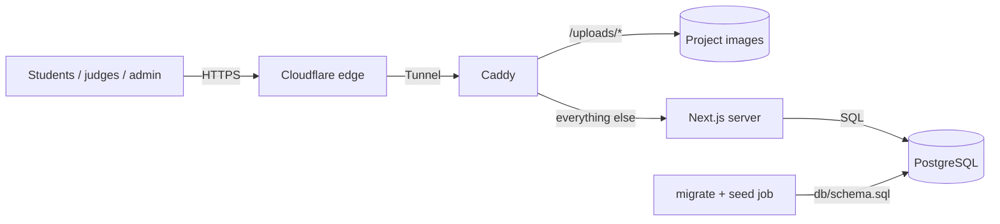

- `proxy.ts` redirects signed-out visitors away from `/admin` and `/upload`; every API route checks the session again on the server.
- A one-shot job applies the idempotent schema (and demo data) before the app container starts.
- Uploaded images are served by Caddy: only image extensions, with `X-Content-Type-Options: nosniff`.

## Security

- **Three roles, three sessions**: student, judge and admin sessions are separate signed cookies; admin credentials live only in the server environment.
- **Least privilege per route**: admin APIs require the admin session; scores require a judge session and ignore any judge id sent by the client; teams can edit only their own projects and never their vote count.
- **Audited moderation**: every admin change to votes, teams, users, projects and winners is written to `admin_audit_log` with before/after values.
- **Upload hardening**: the image format is detected from the file's bytes, which also sets the stored extension.
- **Rate limits** on every login and sign-up endpoint and on the leaderboard and winners APIs, keyed on Cloudflare's `CF-Connecting-IP`.
- Brute-force protection on the admin login (5 attempts per 15 minutes).

## Getting started

**Prerequisites:** Node.js 20+ and PostgreSQL 16.

```bash
git clone https://github.com/mrrobot-1001/projectshowcasefullstack.git
cd projectshowcasefullstack
npm install

cp .env.local.example .env.local   # set DATABASE_URL, SESSION_SECRET, ADMIN_EMAIL, ADMIN_PASSWORD
set -a; . ./.env.local; set +a

node scripts/migrate.mjs           # create / update tables (safe to re-run)
node scripts/seed-demo.mjs         # optional demo teams, projects and accounts
npm run dev                        # http://localhost:3000
```

| Variable | Purpose |
|---|---|
| `DATABASE_URL` | PostgreSQL connection string |
| `SESSION_SECRET` | 32+ random characters for signing sessions (`openssl rand -hex 32`) |
| `ADMIN_EMAIL`, `ADMIN_PASSWORD` | Admin login for `/admin/login` |

## Deployment

The [`Dockerfile`](Dockerfile) builds a slim `runner` image (Next.js standalone, non-root user) and a `builder` image that runs the schema and seed scripts. A Compose stack of `db` → `migrate` → `app` with a volume on `public/uploads` is all that's needed; see [docs/self-hosting.md](docs/self-hosting.md).

## Project structure

```
app/                     pages (home, projects, leaderboard, winners, team, upload, judge, admin, …)
app/api/                 route handlers (auth, projects, likes, scores, winners, teams, admin/*)
components/              navbar, project cards, filters, UI primitives
db/schema.sql            PostgreSQL schema
lib/                     db client, sessions & auth, audit log, uploads, rate limiter, email validation
proxy.ts                 page guards for /admin and /upload
scripts/                 migrate.mjs, seed-demo.mjs
docs/                    self-hosting, email validation rules, performance notes, screenshots
```

---

Built by **Harsh Rana** · [@mrrobot-1001](https://github.com/mrrobot-1001)
